# Site jeux vidéo

RocketLeague-RedSky.fr est un site pour les joueurs de RocketLeague.Vous pourrez trouvez des News et un system de 
Findteam pour trouvez vos coéquipier.
Une connexion, une inscription, un contact et un systeme de DON pour nous soutenir.
Have fun Enjoy !

# Cahier des charges :

**-Domaine :** RocketLeague-RedSky.fr

**-Nom du site :** RedSkyRL.

**-Les couleurs :** Noir,Rouge,Gris. (Les couleurs du logo)

**-Logo :**  

**-Nombres pages :** 7

**-Nom des pages :** Home, Inscription, Connexion, Contact, MentionLegales, FindTeam, Team, Don

**-URL des futures pages :** /home, /subscribe, /login, /contact, /mentionlegales, /findteam, /team, /givegift

## **-*Future fonctionalité du site* :** 

**-Inscription :** -Ajout de l'utilisateur en BDD

**-Connexion :** -Récupération des données utilisateurs en BDD

**-Contact :** -Récupération des données utilisateurs en BDD
               -Envoie de mail a l'entreprise du site.

**-FindTeam :**  -Plusieurs catégories selon le rank de l'utilisateurs  
**(1 2 3 correspond a la division du rank cibler)**  
*(Bronze(1,2,3)),*  
*(Silver(1,2,3)),*  
*(Or(1,2,3)),*  
*(Platine(1,2,3)),*  
*(Diamand(1,2,3)),*  
*(Champion(1,2,3)),*  
*(Grand Champion)*  

                -Création d'un groupe par l'utilisateur, ou choisir de rejoindre un groupe déjà existant  
                -Insertion de l'utilisateur dans le groupe rank choisit  
                -Chat online du groupe entre les joueurs pour l'accord ou non de leurs objectifs   
                -Si deux ou trois joueurs (selon le mode de jeu) on compléter le groupe, alors attendre la validation de tous les joueurs du groupe  
                -Envoie d'une requete automatique invitation Steam pour que les deux joueurs puissent lancez leurs parties

**-Don :** - Page simple qui redirigeras sur un paypal pour un Don. 

# Maquettes mobile first
## Vue du haut de la page Home deconnecter
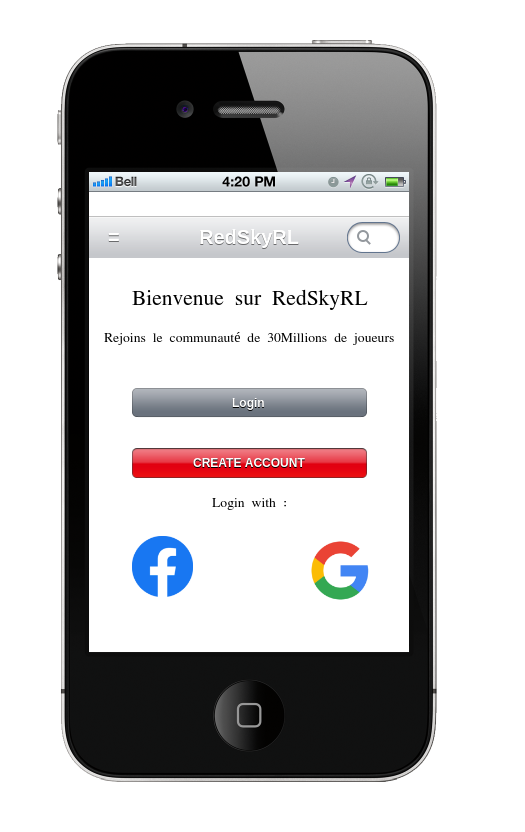
## Vue du haut de la page Home connecter
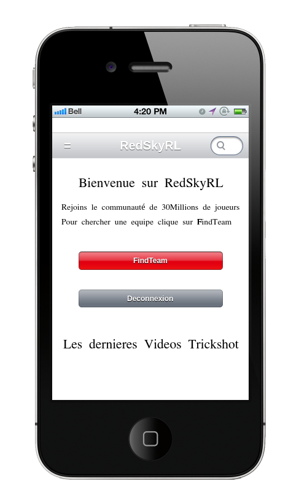
## Vue de la home 'une fois scroll' avec des news (texte et video)

## Burger menu ouvert une fois cliquer
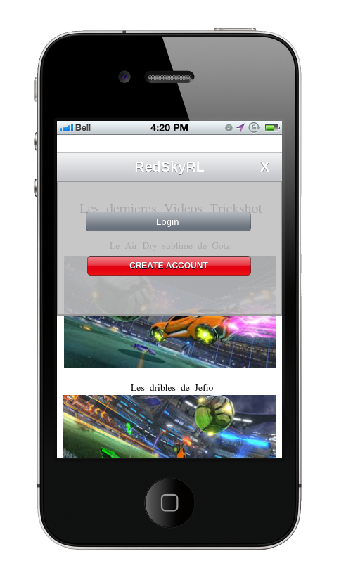
## Burger menu ouvert une fois connecter et cliquer

## Page connexion
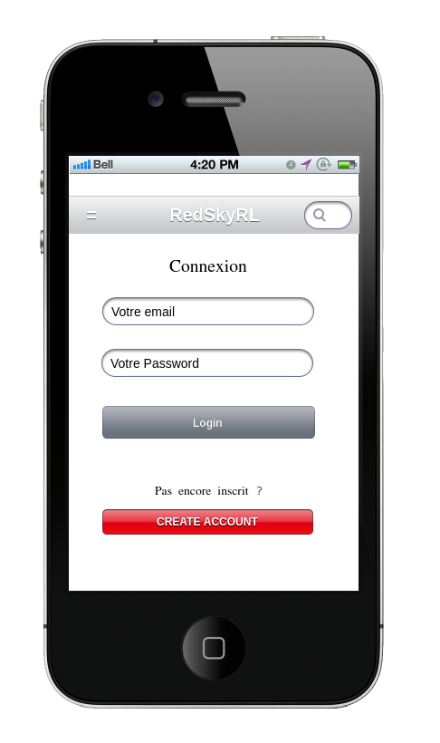
## Page inscription
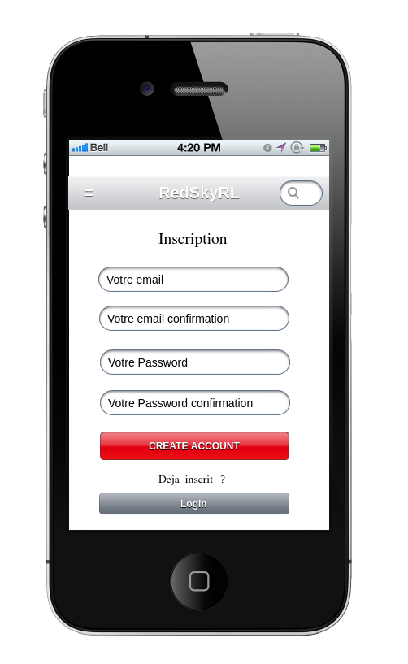
## Page contact

## Page de recherche d'equipe quand on a pas de groupe
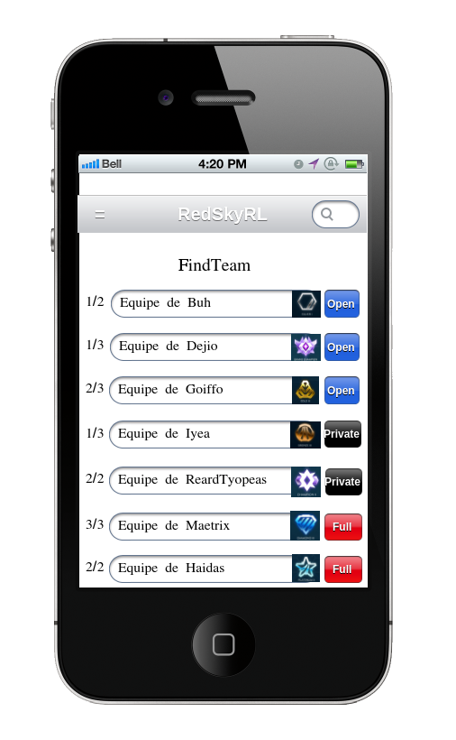
## Page de recherche d'equipe quand on a trouver le groupe
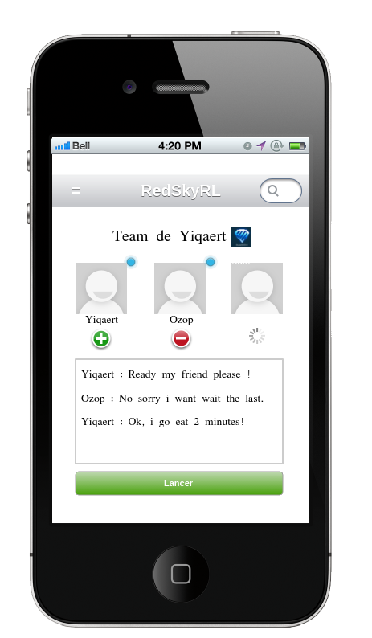
## Page de don
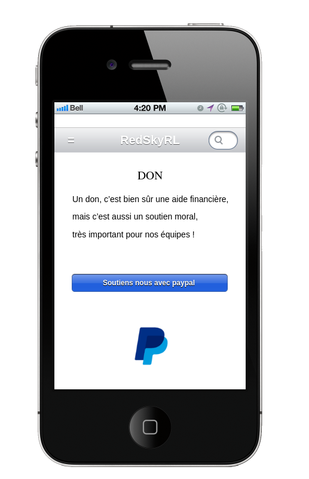
## Page footer default
 

# Maquettes full screen
## Vue du haut de la page home deconnecter

## Vue du haut de la page home connecter

## Vue de la home une fois scroll

## Page de connexion
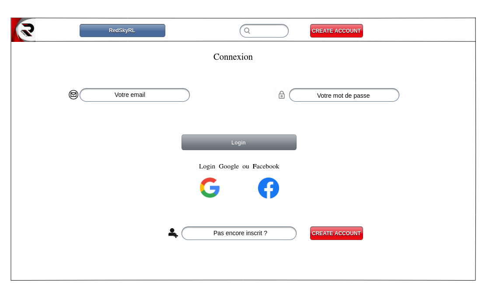
## Page Inscription

## Page Contact
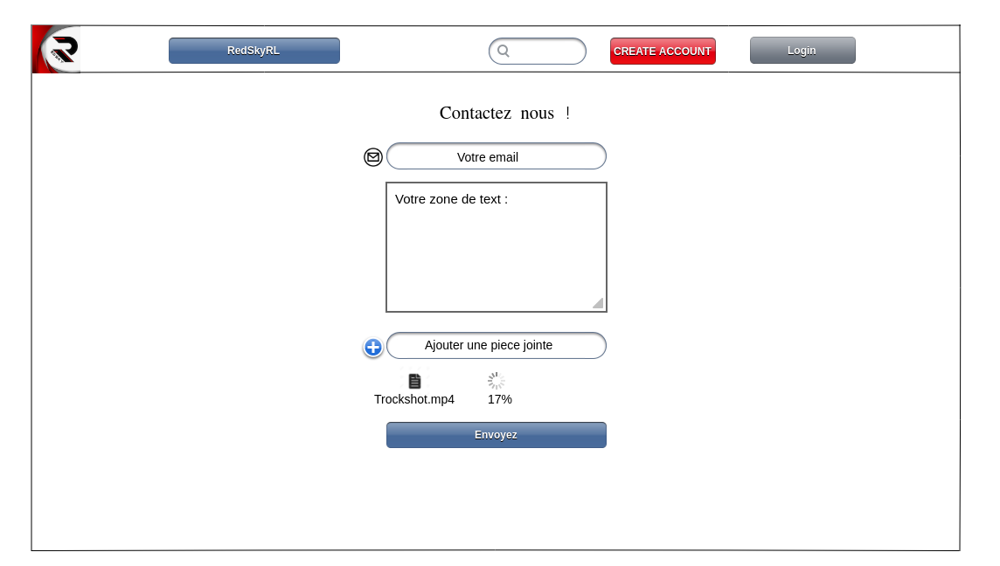
## Page de recherche d'equipe

## Page de  l'equipe
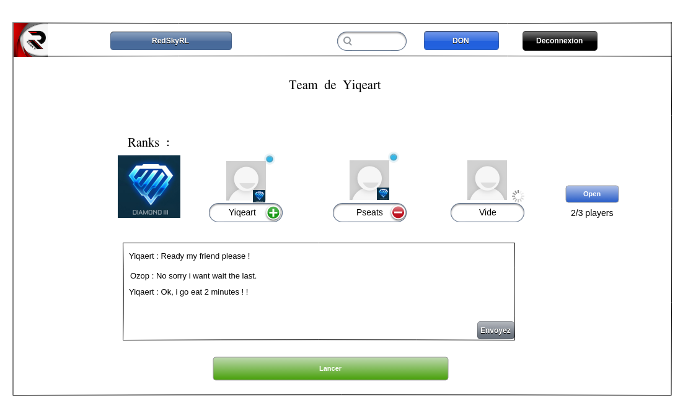
## Page de don

## Page du footer

# Precision a donner

-Le Header dans la version mobile et full screen va suivre l'utilisateur lorsque celui ci va scroll 
-Le titre du site est un boutton home et sera réadapter a l'ecriture du logo  
-Rajout boutton déja inscrit ? sur la page inscription 
-Rajout boutton pas encore inscrit ? sur la page connexion 
-Rajout boutton deconnexion dans le burger une fois connecter 
-Les boutons du footer don et nous contactez /deconnexion celon la version de l'ecran seront bien évidemment changer par connexion et inscription lorsque l'utilisateur seras offline.

# UML
## diagramme uml
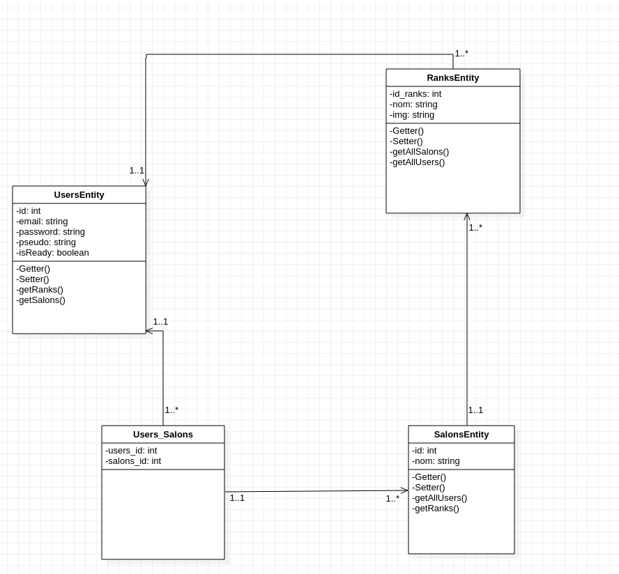